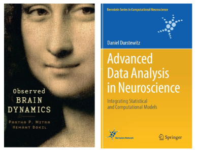

# NeuroPySeminar
### *Advances in Data Analysis: Python*

An interactive Python-based seminar repository diving into contemporary data analysis methods from recent research papers. Engage hands-on with real data, explore foundational theories, and focus on techniques in time series analysis, dimensionality reduction, and dynamical systems.  

---
## Links
[GitHub: NeuroPySeminar](https://github.com/arashshahidi1997/NeuroPySeminar)

[PaperPool](https://drive.google.com/drive/folders/1VpsuUBgtw8SKk-36mkHAx9cFyWfhLA1e?usp=drive_link)

[Slides](https://drive.google.com/drive/folders/1QMZwbCVyKqIJ01K1uxoHsYW4xBDH8xlG?usp=drive_link)

[ZoomRecordings](https://drive.google.com/drive/folders/1o9tTZ_LfwnQWAnxSxXk3oYVJTAju2xeJ?usp=drive_link)

[LSF](https://lsf.verwaltung.uni-muenchen.de/qisserver/rds?state=verpublish&status=init&vmfile=no&publishid=1094473&moduleCall=webInfo&publishConfFile=webInfo&publishSubDir=veranstaltung)

[Moodle](https://moodle.lmu.de/course/view.php?id=31553)

---
## Course Description
Type of Course: Seminar
LSF Number: 19409
Term: WiSe2025/26
Max. participants: 12
Language: English
Title: Advances in Data Analysis: Python

*Shahidi, Arash, Phd Student at Sirota Lab*
*Faculty of Biology - Ludwig-Maximilian University of Munich*

This seminar introduces recent data analysis methods highlighted in current research papers. Using Python, participants will  implement these techniques and apply to data, either publicly available or data from their own projects. We'll particularly focus on analysis methods regarding ***time series data, dimensionality reduction, and dynamical systems***. The foundational theories behind these methods will be discussed, referencing established analytical texts.

---
## Assessment
- **60% *Main Presentations*:**
	Presenting (at least) **one** theory session (50 min) along with the corresponding exercise session (30 min).
	- send your ***top 3 choices***  from the paper pool to the instructor.
- **40% *Short Exercise Presentations*:**
	Presenting 3 exercises (10 min /exercise) on 3 topics other than their selected topic.
	- Other than the provided exercises, applying the methods to any publicly available data, simulated demos, or data from personal projects, also counts as an exercise and is encouraged.

---
## Text Books

In addition to the papers, the following books will be referred to

- Observed Brain Dynamics, Mitra & Bokil
- Advanced Data Analysis in Neuroscience, Daniel Durstewitz

---
## Recommended tools and resources
- [https://goodresearch.dev/](https://goodresearch.dev/) A short Handbook on how to setup and organize your projects in Python.
- **VSCode**: A popular IDE with an abundance of plugins that make coding easier
- **Github Copilot** : AI coder added as a plugin to VSCode - Free for all students and teachers Apply for GitHub [Education Benefits](https://github.com/settings/education/benefits).
- **Google Colab**

Other useful tools:
- Obsidian
- Zotero
- ChatGPT, Claude, etc.
