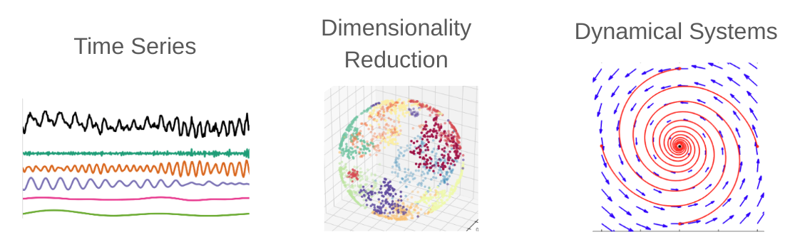

# NeuroPySeminar
An interactive Python-based seminar repository diving into contemporary data analysis methods from recent research papers. Engage hands-on with real data, explore foundational theories, and focus on techniques in time series analysis, dimensionality reduction, and dynamical systems.  

---
# Advances in Data Analysis 

Type of Course: Seminar
Number: 19409
Term: WiSe2025/26
Max. participants: 12
Language: English
Long text: Advances in Data Analysis: Python
Frequency: Every Winter Semester

Lecturer:
*Shahidi, Arash, Phd Student at Sirota Lab*

Organisationsal Unit:
*Faculty of Biology - Ludwig-Maximilian University of Munich*

**Content**:
Implementing new data analysis methods used in recent publications in python, with the aim of reproducing and exploring results from the papers, with a side look at the theoretical and algorithmic basis of the methods relying on analysis text books.

**Learning outcome**:
Students obtain hands on experience with implementation of recent data analysis methods and reproduce and explore data from published papers, preparing them for using the methods and potentially adapting them to their own research needs. The seminar will also provide students with knowledge on how to critically evaluate 

**Course Description**:

**Content**: This seminar introduces recent data analysis methods highlighted in current research papers. Using Python, participants will actively implement these techniques, gaining firsthand experience. The foundational theories behind these methods will be discussed, referencing established analytical texts. We'll particularly focus on analysis methods regarding time series data, dimensionality reduction, and dynamical systems.

**Learning Outcomes**:

1. Grasp and apply contemporary data analysis methods from recent research.
2. Efficiently utilize Python to implement and validate these techniques.
3. Comprehend the basic theoretical principles underpinning these methods.
4. Acquire the capability to assess and modify these techniques for specific research objectives.

---

## Text Books
In addition to the papers, the following books will be referred to

- Observed Brain Dynamics, Mitra & Bokil
- Advanced Data Analysis in Neuroscience, Daniel Durstewitz

## Recommended tools and resources

- [https://goodresearch.dev/](https://goodresearch.dev/) A short Handbook on how to setup and organize your projects in Python.
- **VSCode**: A popular IDE with an abundance of plugins that make coding easier
- **Github Copilot** : AI coder added as a plugin to VSCode - Free for all students and teachers Apply for GitHub [Education Benefits](https://github.com/settings/education/benefits).
- **Google Colab**

Other useful tools:
- Obsidian
- Zotero
- ChatGPT, Claude, etc.

