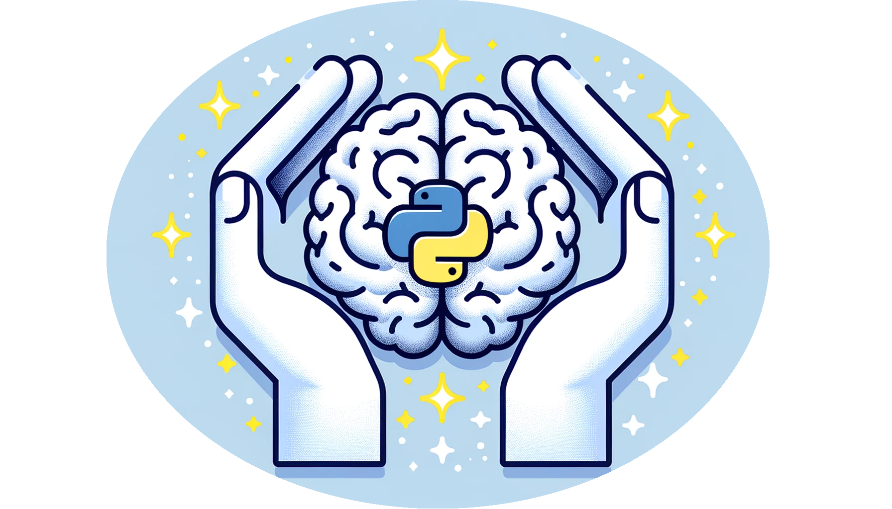

# Links

[PaperPool](https://drive.google.com/drive/folders/1VpsuUBgtw8SKk-36mkHAx9cFyWfhLA1e?usp=drive_link)

[Slides](https://drive.google.com/drive/folders/1QMZwbCVyKqIJ01K1uxoHsYW4xBDH8xlG?usp=drive_link)

[ZoomRecordings](https://drive.google.com/drive/folders/1o9tTZ_LfwnQWAnxSxXk3oYVJTAju2xeJ?usp=drive_link)

# NeuroPySeminar
An interactive Python-based seminar repository diving into contemporary data analysis methods from recent research papers. Engage hands-on with real data, explore foundational theories, and focus on techniques in time series analysis, dimensionality reduction, and dynamical systems.  
see
- [CourseDescription](./CourseDescription)
- [References](./References)

